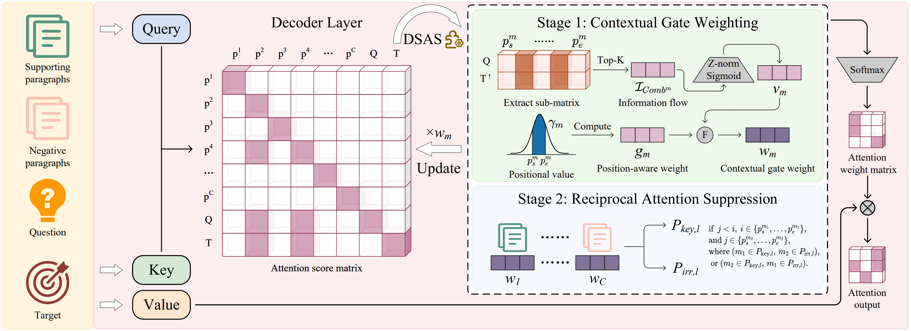

# 🔌 DSAS: A Universal Plug-and-Play Framework for Attention Optimization in Multi-Document Question Answering

## 🔍 Key Findings

🛠 In this paper, we find the attention dilution phenomenon in Multi-doc QA, revealing two critical limitations: 

* *(1) Limited long-range dependency modeling,* 
* *(2) Persistent "lost-in-the-middle" issue.*

## 📈 Analysis Results

Firstly, we conduct information flow analysis on both paragraph disparity level and answer quality level.

This reveals layer-wise information flow propagation patterns and discrepancies between good and bad samples.

<div align="center">

</div>

<div align="center">

</div>

## 💡Methodology

To address these issues, we propose **Dual-Stage Adaptive Sharpening (DSAS)**, a training-free attention optimization mechanism comprising two modules: **Contextual Gate Weighting (CGW)** and **Reciprocal Attention Suppression (RAS)**.

🖼️ The figure below illustrates our proposed framework.



## ⚙️ Environment and Requirements

```sh
- python 3.10
- Ubuntu 22.04
- NVIDIA A800
- Memory 80G
```

```sh
pip install -r requirements.txt
```

## 📑 Data Preparation

Download [HotpotQA](https://hotpotqa.github.io/), [2WikiMultiHopQA](https://github.com/Alab-NII/2wikimultihop), and [MuSiQue](https://github.com/stonybrooknlp/musique) from their official websites and put their train/dev/test splits under `data/`.

Download their [LongBench extensions](https://github.com/THUDM/LongBench/tree/main/LongBench) and place the files under `data/longtext`.


## ✨ Preprocess

This step prepares the inputs for inference. The files will be saved at: `data/preprocess`

```sh
# for HotpotQA, 2WikiMultiHopQA, MuSiQue
python data_preprocess.py --task hotpotqa
# for LongBench
python longbench_preprocess.py --task hotpotqa
```

## 📈 Analyze information flow patterns
Run `analysis.py` file to save information flow results.
```sh
python analysis.py --task_name hotpotqa --model_name llama-3.1-8b-instruct
```

Go to `paragraph_ana.ipynb` and `answer_ana.ipynb` to analyze information flow patterns on paragraph disparity level and answer quality level.
## ⚖️ Comparative Inference

### Baseline Methods

```sh
# for HotpotQA, 2WikiMultiHopQA, MuSiQue
python method/baseline.py --task_name hotpotqa --model_name llama-3.1-8b-instruct
# for LongBench
python method/baseline_longbench.py --task_name long-hotpotqa --model_name llama-3.1-8b-instruct
```

### DSAS Implementation

```sh
# for HotpotQA, 2WikiMultiHopQA, MuSiQue
python method/DSAS.py --task_name hotpotqa --model_name llama-3.1-8b-instruct
# for LongBench
python method/DSAS_longbench.py --task_name long-hotpotqa --model_name llama-3.1-8b-instruct
```

## 📊 Evaluation

```sh
python save_res.py --model_name llama-3.1-8b-instruct --is_baseline True
```
